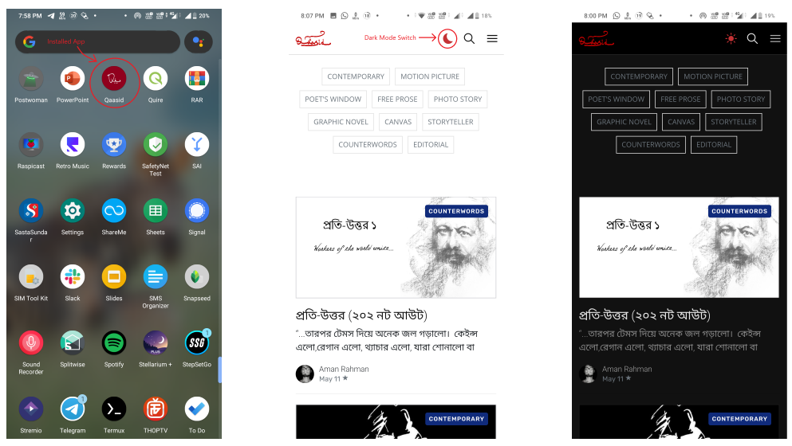
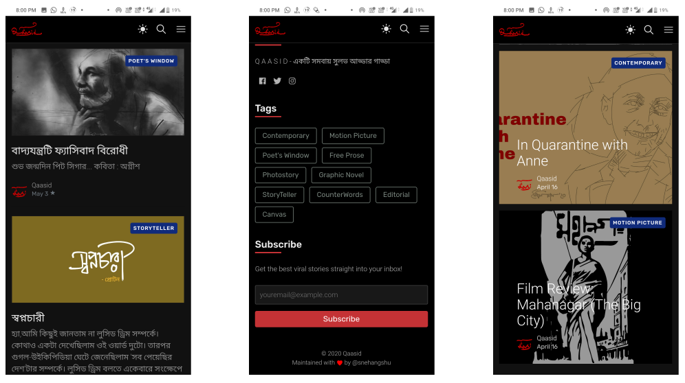

# WebView based App for Blogging Platform Qaasid

This is a [flutter](https://flutter.dev) project that uses WebView to make an Android App.

## The Blogging Platform

[qaasid.live](https://qaasid.live) is a blogging platform made by me based using a NodeJs CMS (Content Management System) called [ghost](https://ghost.org/). This platform was specially made for Bengali Language. The server end code can be found [here](https://github.com/forkbomb-666/ghost-on-heroku). 

Some technical details about the project:

- The frontend is hosted on [heroku](https://heroku.com).
- It uses MySQL database, hosted on Amazon Web Services RDS.
- For file storage (images, videos, configurations) it uses [cloudinary](https://cloudinary.com/).
- Notable feature: :first_quarter_moon: Dark / Light mode support.

## App Screenshots

## How to Get

Check the [release](https://github.com/forkbomb-666/qaasid_flutter_webview_app/releases) page to download the APK.
